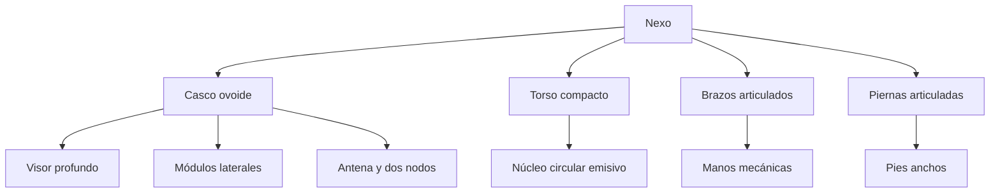

# Ficha canónica de modelado: Nexo 3D

**Estado:** propuesta de producción; requiere revisión humana antes de abrir el
issue de blockout.

**Trazabilidad:** [issue #10](https://github.com/jeresoftx/academy-web/issues/10)
del Project de Nexo. Esta ficha interpreta el arte aprobado para modelado; no
reemplaza las decisiones del Manual Fundacional RFC-0001.

## Concepto

Nexo es el compañero de taller de Jeresoft Academy: una máquina compacta,
modular y serena. Su presencia debe sugerir oficio, curiosidad y construcción
cuidadosa. Acompaña, orienta y celebra avances breves; nunca compite con la
lectura ni se presenta como una persona consciente.

La referencia principal es la
[lámina de concepto aprobada](../assets/nexo-concept-01.png). El modelo 3D
debe conservar su materialidad editorial —grafito envejecido, visor profundo y
energía dorada— sin intentar copiar cada píxel o inconsistencia propia de una
imagen conceptual generada.

## Problema

La lámina reúne varias poses, expresiones y vistas, pero no define una malla
única. Modelar directamente sobre ella conduce a decisiones contradictorias:
una cabeza puede parecer más redonda en una vista y más ancha en otra; algunos
detalles funcionan como iluminación editorial y no como piezas físicas.

## Alternativas

1. Trazar una vista aislada y completar el resto por intuición.
2. Usar una cabeza cúbica o una esfera perfecta por comodidad de modelado.
3. Definir una anatomía canónica de bajo riesgo y validar su silueta antes de
   detallar.

## Decisión

Se adopta la tercera alternativa. La geometría inicial se construirá con
volúmenes simples derivados de esta ficha. No se crearán paneles, tornillos,
texturas, rig ni animaciones hasta aprobar el blockout desde las cuatro vistas.

## Referencia y lectura correcta

La cabeza de Nexo **no es una barra rectangular** y tampoco una pelota perfecta.
Es una carcasa ovoide y ancha, cercana a una esfera mecánica aplastada en el eje
vertical, con un visor oscuro incrustado en su cara frontal. Sus laterales
incluyen módulos circulares; el contorno completo debe sentirse pesado, suave y
redondeado.

La vista tres cuartos frontal de la lámina es la pose de presentación. Las
vistas frontal, lateral y posterior de la franja inferior sirven para comprobar
simetría, profundidad y unión de piezas. Las expresiones laterales son una guía
del rostro y del núcleo, no variantes de anatomía.

## Proporciones canónicas

La unidad de composición es la altura total de Nexo, `H = 1.00`. Las medidas son
relativas: mantienen proporción durante el blockout y se convierten a metros
reales en el contrato técnico del issue #11.

| Zona                | Proporción objetivo | Lectura visual                                     |
| ------------------- | ------------------: | -------------------------------------------------- |
| Altura total        |            `1.00 H` | Compacto y estable, nunca esbelto.                 |
| Cabeza, ancho       |            `0.54 H` | Más ancha que el torso.                            |
| Cabeza, alto        |            `0.34 H` | Ovoide horizontal, no bloque.                      |
| Cabeza, profundidad |            `0.30 H` | Volumen suficiente para visor y módulos laterales. |
| Torso, alto         |            `0.24 H` | Núcleo a la vista y hombros robustos.              |
| Piernas y pies      |            `0.31 H` | Cortos, separados y pesados.                       |
| Antena sobre cabeza |            `0.12 H` | Pequeño grafo de dos nodos luminosos.              |

Estas relaciones tienen prioridad sobre una dimensión aislada del concept art.
Si una vista contradice a otra, la silueta frontal y la legibilidad a tamaño
pequeño deciden.

## Anatomía y despiece

| Pieza             | Forma canónica                                | Regla de modelado                                                            |
| ----------------- | --------------------------------------------- | ---------------------------------------------------------------------------- |
| Casco             | Ovoide redondeado con carcasa exterior        | Empezar con volumen casi esférico; nunca con cubo biselado como forma final. |
| Visor             | Ventana negra, amplia y de esquinas orgánicas | Debe sentirse como una cavidad protegida, no como una pantalla pegada.       |
| Módulos laterales | Discos mecánicos compactos                    | Simétricos y subordinados al casco.                                          |
| Antena            | Base corta, brazos finos y dos nodos          | Sugiere conexión entre ideas; no debe elevar demasiado la silueta.           |
| Torso             | Cápsula mecánica corta                        | Más angosto que la cabeza y orientado al núcleo.                             |
| Núcleo            | Disco circular con patrón radial              | Pieza independiente para estados visuales futuros.                           |
| Brazos            | Tres masas articuladas por lado               | Hombro, antebrazo y mano con volumen robusto.                                |
| Manos             | Mecánicas, expresivas y legibles              | Preparadas para señalar, saludar y descansar; sin dedos hiperrealistas.      |
| Piernas y pies    | Segmentos cortos con pies pesados             | El centro de gravedad debe verse bajo y estable.                             |

## Rasgos de identidad no negociables

- Visor negro profundo, con dos ojos dorados separados y boca visible.
- Cejas y boca son elementos independientes: podrán variar sin remodelar el
  casco.
- Antena superior con exactamente dos nodos luminosos conectados.
- Núcleo circular dorado visible en el centro del torso.
- Grafito mecánico como material principal; dorado como energía y acento, nunca
  como color dominante de la carcasa.
- Desgaste sutil de taller: paneles, uniones y marcas discretas, no suciedad que
  reduzca legibilidad.
- Silueta amable y robusta; no humanoide esbelto, arma, vehículo ni mascota
  infantil genérica.

## Materialidad objetivo

| Material                | Intención                          | Aplicación                                                |
| ----------------------- | ---------------------------------- | --------------------------------------------------------- |
| Grafito envejecido      | Metal mate, trabajado y resistente | Casco, torso, extremidades y paneles.                     |
| Visor negro             | Profundidad y contraste            | Superficie frontal, sin reflejos que oculten expresiones. |
| Dorado cálido           | Energía, atención y señalización   | Ojos, antena, núcleo y acentos selectivos.                |
| Metal oscuro secundario | Separar piezas móviles             | Articulaciones, uniones y perfiles.                       |

Los valores PBR concretos, UV y tamaño de texturas se definen en el contrato
técnico. En esta etapa se valida el lenguaje de materiales, no mapas finales.

## Poses y expresiones de referencia

La primera pose de reposo usa una orientación tres cuartos frontal, manos bajas,
cabeza levemente inclinada y mirada atenta. La anatomía debe soportar las
siguientes acciones sin alterar su identidad:

- reposo y respiración mínima;
- saludo;
- pensamiento, con una mano cerca del visor;
- señalamiento;
- celebración;
- cambios de ojos, cejas, boca y núcleo.

Estados como frío o calor pertenecen a la futura animación; la escarcha, vapor
o partículas de la lámina no se modelan como parte del cuerpo base.

## Qué no se modela en el blockout

- tornillos, rayones, juntas finas o patrones del núcleo;
- dedos individuales, cables, rejillas y decoración interna;
- iluminación, halo, sombra de contacto o humo;
- expresiones faciales finales;
- materiales, UV, rig, huesos o animaciones.

## Revisión humana del model sheet

Antes de iniciar [#12](https://github.com/jeresoftx/academy-web/issues/12), se
confirma:

- [ ] La cabeza se reconoce como casco ovoide ancho, no como barra ni esfera
      perfecta.
- [ ] El visor, la antena y el núcleo son visibles desde la pose de
      presentación.
- [ ] Cabeza, torso, pies y antena respetan las proporciones canónicas.
- [ ] La anatomía permite animar expresiones y acciones planeadas.
- [ ] La ficha conserva el carácter del arte aprobado sin prometer conciencia o
      autonomía a Nexo.

Con la aprobación de esta ficha, Blender pasa de exploración libre a ejecución
contra una referencia compartida.
