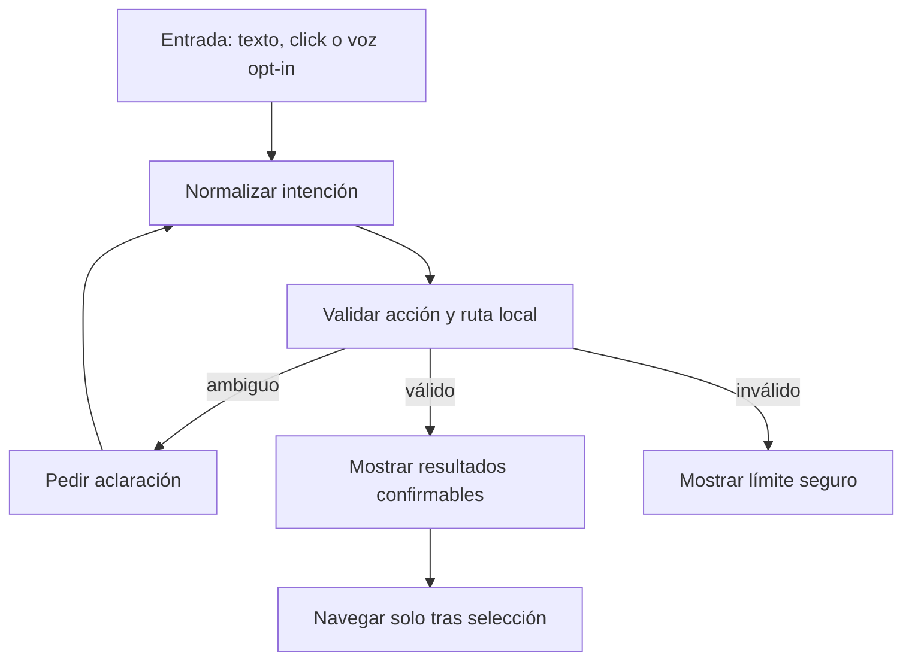

# Contrato de interacción: Nexo bibliotecario

**Estado:** propuesta de interacción; requiere revisión humana.

**Trazabilidad:** [issue #20](https://github.com/jeresoftx/academy-web/issues/20).
Este contrato define qué puede hacer Nexo dentro de `academy-web` antes de
agregar conversación ligera, voz o recuperación contextual. La regla central es
simple: Nexo guía a la persona por la academia, no improvisa navegación ni
sustituye la lectura.

## Concepto

Nexo funciona primero como bibliotecario determinista: ayuda a buscar cursos,
abrir capítulos, mostrar prerequisitos y orientar el camino de estudio. La
conversación aparece después, limitada por acciones explícitas y rutas
existentes.

Una respuesta de Nexo siempre debe poder reducirse a una intención validada:
buscar, abrir, explicar una ruta, mostrar relación entre cursos o pedir una
aclaración. Si la intención no puede validarse, Nexo responde con una opción
segura en vez de inventar.

## Problema

Mezclar mascota, chat, voz, arrastre y navegación sin contrato vuelve ambigua la
experiencia:

- un click puede abrir chat cuando la persona quería mover la mascota;
- una escucha continua puede sentirse invasiva;
- una respuesta generativa puede inventar rutas que no existen;
- una navegación automática puede sacar a la persona de su lectura;
- una interacción sin teclado excluye a personas que no usan mouse;
- una animación persistente puede distraer o romper `prefers-reduced-motion`.

La solución no es hacer a Nexo "más inteligente" de entrada. La solución es
cerrar sus acciones, validar destinos y dejar la conversación como capa
opcional.

## Alternativas

1. **Conversación libre desde el inicio.** Parece flexible, pero aumenta
   alucinación, costo, incertidumbre de privacidad y navegación accidental.
2. **Mascota puramente decorativa.** Reduce riesgo, pero no aprovecha a Nexo
   como interfaz de orientación.
3. **Navegador determinista con conversación acotada.** Mantiene valor real,
   accesibilidad y trazabilidad antes de sumar IA más compleja.

Se adopta la tercera alternativa.

## Estados de interacción

| Estado         | Entrada                    | Resultado permitido                               |
| -------------- | -------------------------- | ------------------------------------------------- |
| `idle`         | Sin interacción activa     | Nexo permanece discreto y no bloquea contenido.   |
| `hover`        | Cursor o foco sobre Nexo   | Muestra affordance mínima de interacción.         |
| `dragging`     | Movimiento sostenido       | Cambia posición sin abrir burbuja ni navegar.     |
| `bubble_open`  | Click rápido o teclado     | Abre comandos visibles y buscador.                |
| `push_to_talk` | Click sostenido confirmado | Captura voz solo mientras se sostiene el control. |
| `thinking`     | Acción en proceso          | Indica espera breve y permite cancelar.           |
| `result`       | Respuesta validada         | Muestra opciones con destinos comprobados.        |
| `error`        | Intención inválida o falla | Explica límite y ofrece acciones seguras.         |

Nexo no tiene estado de escucha pasiva. La voz es siempre opt-in, visible,
temporal y cancelable.

## Gestos y equivalentes accesibles

| Intención        | Mouse/touch                            | Teclado                                  | Regla                              |
| ---------------- | -------------------------------------- | ---------------------------------------- | ---------------------------------- |
| Abrir burbuja    | Click rápido                           | `Enter` o `Space` sobre el botón de Nexo | No navega automáticamente.         |
| Arrastrar        | Movimiento mayor al umbral             | Controles de posición en la burbuja      | No abre chat durante el arrastre.  |
| Push-to-talk     | Presión sostenida en control visible   | Mantener botón enfocado con `Space`      | Nunca escucha fuera de este gesto. |
| Cancelar         | `Esc`, soltar control o botón cancelar | `Esc`                                    | Regresa a estado seguro.           |
| Elegir resultado | Click en opción                        | Flechas + `Enter`                        | Solo rutas existentes.             |

La burbuja debe tener rol accesible, foco atrapado solo cuando sea modal y
salida clara. En móvil, la zona táctil mínima de acciones primarias es de
`44 px`.

## Acciones cerradas

Nexo solo puede ejecutar estas acciones de navegación:

| Acción                 | Parámetros requeridos          | Validación                                |
| ---------------------- | ------------------------------ | ----------------------------------------- |
| `search`               | `query`                        | Busca en cursos/capítulos indexados.      |
| `open_course`          | `course_slug`                  | El curso existe y tiene ruta publicada.   |
| `open_chapter`         | `course_slug`, `chapter_slug`  | Curso y capítulo existen juntos.          |
| `show_path`            | `course_slug`                  | El curso tiene prerequisitos o secuencia. |
| `show_prerequisites`   | `course_slug` o `chapter_slug` | La relación existe en datos locales.      |
| `explain_current_page` | `pathname`                     | La ruta actual pertenece a `academy-web`. |
| `ask_clarification`    | `question`, `options`          | No cambia ruta.                           |

No existen acciones abiertas como `redirect`, `run_code`, `send_message`,
`install`, `delete`, `publish` o `edit_content`. Cualquier capacidad futura
requiere issue propio, criterios de aceptación y revisión humana.

## Esquema de respuesta

Toda respuesta interna de Nexo se normaliza antes de tocar la interfaz:

```json
{
  "intent": "open_chapter",
  "confidence": "high",
  "spoken_summary": "Abrí el capítulo de Sliding Window.",
  "visible_summary": "Sliding Window",
  "actions": [
    {
      "type": "open_chapter",
      "label": "Abrir capítulo",
      "course_slug": "rust-algorithms",
      "chapter_slug": "sliding-window"
    }
  ],
  "fallback": {
    "type": "search",
    "query": "sliding window"
  }
}
```

Reglas del esquema:

- `intent` debe pertenecer a una lista cerrada;
- `confidence` solo admite `low`, `medium` o `high`;
- `actions` no puede estar vacío salvo en `ask_clarification` o `error`;
- cada ruta se valida contra datos locales antes de renderizar;
- `spoken_summary` no se usa si la voz está desactivada;
- `visible_summary` no debe ocultar la acción real;
- `fallback` siempre es seguro y no navega sin confirmación.

## Flujo de búsqueda

La implementación inicial vive en `src/lib/nexo/navigation.ts` y en la ruta
`/search/`. El registro de navegación se deriva de `src/data/courses.ts` y
`src/data/lessons.ts`; no se mantiene una copia manual de cursos o capítulos
dentro de Nexo. Las consultas se normalizan, se sanitizan para construir
parámetros visibles y se resuelven contra rutas locales antes de mostrarse.



## Privacidad y límites

- No hay escucha continua.
- No se envía audio sin gesto explícito de push-to-talk.
- La posición de Nexo puede guardarse localmente; no requiere cuenta.
- Las consultas de búsqueda pueden ejecutarse localmente cuando el índice lo
  permita.
- Si en el futuro se usa un modelo remoto, la interfaz debe declarar qué se
  envía y por qué.
- Nexo no guarda secretos, credenciales ni datos sensibles.

## Criterios de aceptación

- Click rápido abre burbuja; click sostenido usa push-to-talk; movimiento
  inicia arrastre.
- Cada gesto tiene equivalente de teclado.
- Las acciones cerradas son buscar, abrir curso, abrir capítulo, mostrar camino
  y mostrar prerequisitos.
- Toda respuesta pasa por un esquema estructurado.
- Las rutas se validan contra datos existentes antes de mostrarse.
- No hay escucha continua.
- No hay redirecciones inventadas.

## Trabajo fuera de alcance

Este contrato no implementa Whisper, TTS, modelo local, OpenSearch ni búsqueda
híbrida. Esas decisiones viven en issues posteriores del milestone
`Nexo — Biblioteca, conversación y voz`.

La primera evaluación de conversación local queda documentada por separado en
[`nexo-local-conversation-evaluation.md`](./nexo-local-conversation-evaluation.md).
