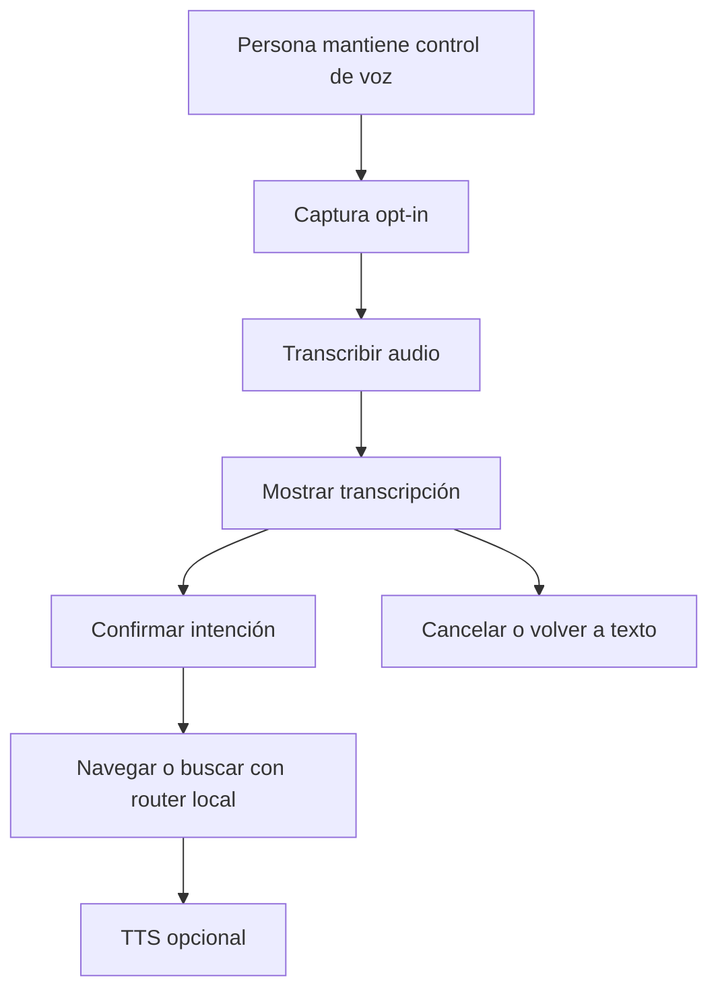

# Diseño de voz opt-in para Nexo

**Estado:** propuesta técnica; requiere revisión humana antes de implementar
captura de audio, Whisper o TTS.

**Trazabilidad:** [issue #23](https://github.com/jeresoftx/academy-web/issues/23).

La voz de Nexo debe sentirse cercana sin convertir el sitio en un dispositivo de
escucha. La regla central es simple: la persona decide cuándo capturar audio,
ve la transcripción antes de navegar y siempre conserva una alternativa textual.

## Concepto

La voz puede ser una entrada cómoda para pedir rutas, búsquedas o aclaraciones
breves. Whisper, o cualquier transcriptor futuro, solo traduce audio a texto; no
decide acciones. La salida TTS es una capa separada, opcional y apagada por
defecto.

## Problema

El audio introduce riesgos que no existen con texto:

- escucha pasiva o sensación de vigilancia;
- permisos de micrófono difíciles de entender;
- captura accidental;
- transcripciones incorrectas que navegan sin confirmación;
- dependencia de voz para personas que prefieren teclado;
- TTS invasivo en espacios compartidos;
- expectativas de sincronía labial o conversación continua.

La primera versión debe evitar esos riesgos antes de agregar cualquier motor.

## Alternativas

1. **Micrófono continuo o palabra de activación.** Se descarta: es invasivo,
   difícil de explicar y contrario al contrato de Nexo.
2. **Push-to-talk con transcripción visible.** Se adopta para evaluación: la
   persona mantiene el control y puede corregir antes de actuar.
3. **Solo entrada de texto.** Sigue siendo el respaldo obligatorio y el estado
   seguro cuando no hay permisos o no se desea voz.

## Política ejecutable

La política vive en `src/lib/nexo/voice-policy.ts`.

| Dimensión      | Regla                                                |
| -------------- | ---------------------------------------------------- |
| Activación     | Solo `hold_button` o `keyboard_hold`.                |
| Duración       | Máximo 15 segundos por captura.                      |
| Transcripción  | Siempre visible antes de navegar o buscar.           |
| Respaldo       | La entrada textual debe existir siempre.             |
| Escucha pasiva | Prohibida.                                           |
| Audio          | Se descarta después de transcribir.                  |
| TTS            | Separado de Whisper, opcional y apagado por defecto. |
| Sincronía      | No se promete lip-sync inicial.                      |

## Flujo permitido

Nexo nunca debe abrir una ruta solo por haber entendido audio. La transcripción
se vuelve texto visible y pasa por el mismo router determinista que usa la
búsqueda.

## Estados de interfaz

| Estado              | Descripción                                          |
| ------------------- | ---------------------------------------------------- |
| `voice_idle`        | Micrófono apagado; se muestra entrada textual.       |
| `voice_ready`       | Control enfocado o presionado, sin captura aún.      |
| `voice_capturing`   | Captura activa mientras se sostiene el control.      |
| `voice_transcribed` | Texto visible, editable o cancelable.                |
| `voice_confirming`  | Nexo muestra la intención detectada.                 |
| `voice_error`       | Permiso, silencio, duración o transcripción fallida. |

Todos los estados deben poder abandonarse con `Esc`, soltando el control o
usando un botón visible de cancelar.

## Manejo de permisos y fallas

- Si no hay permiso de micrófono, se conserva la entrada de texto.
- Si la captura supera el límite, se corta y se pide intentar de nuevo.
- Si Whisper falla, no se reintenta indefinidamente.
- Si la transcripción es ambigua, Nexo pide aclaración.
- Si TTS está apagado, la respuesta visible sigue siendo completa.

## Criterios de publicación futura

Antes de implementar captura real se requiere un issue posterior que defina:

- motor de transcripción, licencia, tamaño y forma de distribución;
- si Whisper corre localmente, remoto o como servicio propio;
- política de descarte de audio verificable;
- pruebas de permisos, cancelación y duración máxima;
- fallback textual en navegadores sin soporte;
- decisión humana explícita sobre TTS.

## Fuera de alcance

Este documento no incorpora Whisper, Web Speech API, grabación real, TTS, modelo
local ni avatar con sincronía labial. Solo fija el diseño y la política mínima
para que una implementación futura no empiece desde una zona ambigua.
